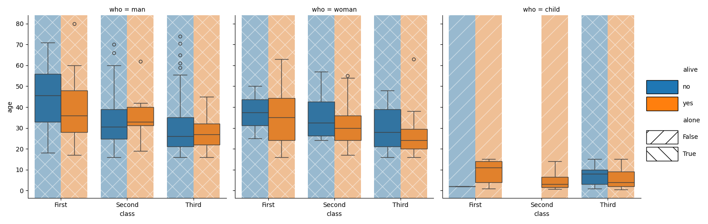

[

](https://pypi.python.org/pypi/backstrip)
[

](https://github.com/mmore500/backstrip/actions)
[
](https://github.com/mmore500/backstrip)
[](https://zenodo.org/doi/10.5281/zenodo.10701180)

**_backstrip_** adds color-coordinated fill behind matplotlib boxplots

- Free software: MIT license
- Repository: <https://github.com/mmore500/backstrip>
- Documentation: <https://github.com/mmore500/backstrip/blob/master/README.md>

## Install

`python3 -m pip install backstrip`

## Example Usage

```python3
from backstrip import backstrip
from matplotlib import pyplot as plt
import seaborn as sns

titanic = sns.load_dataset("titanic")
ax = sns.boxplot(data=titanic, x="age", y="class", hue="alive", orient="h")
backstrip(ax, hatch=["oo", "xx"], orient="h")

plt.show()
```


---

```python3
from backstrip import backplot
from matplotlib import pyplot as plt
import seaborn as sns

g = backplot(
    data=sns.load_dataset("titanic"),
    x="class",
    y="age",
    hue="alive",
    col="who",
    style="alone",  # hatches by this column
)

plt.show()
```



## API

See function docstrings for full parameter and return value descriptions.

### `backstrip`: direct, axes-level interface

```python3
def backstrip(
    ax: plt.Axes,
    alpha: float = 0.5,
    hue: typing.Optional[typing.Iterable[str]] = None,
    hatch: typing.Optional[typing.Iterable[str]] = None,
    hatch_color: typing.Union[str, typing.Iterable[str]] = "white",
    orient: typing.Literal["v", "h"] = "v",
    **kwargs,
) -> None:
"""
Draws background strips behind boxplot patches on a matplotlib Axes
object to enhance the visual identifiability of hue-keyed groups.

This function iterates over PathPatch objects (representing boxes) within a
matplotlib Axes, and draws semi-transparent rectangles (strips) in the
background.

These strips can be customized in color (`hue`), pattern (`hatch`), and
orientation (`orient`).
"""
```

### `backplot`: tidy-data, figure-level interface

```python3
def backplot(
    data: pd.DataFrame,
    x: typing.Optional[str] = None,
    y: typing.Optional[str] = None,
    hue: typing.Optional[str] = None,
    style: typing.Optional[str] = None,
    col: typing.Optional[str] = None,
    row: typing.Optional[str] = None,
    order: typing.Optional[typing.Sequence[str]] = None,
    hue_order: typing.Optional[typing.Sequence[str]] = None,
    style_order: typing.Optional[typing.Sequence[str]] = None,
    hatches: typing.Optional[typing.Sequence[str]] = None,
    orient: typing.Literal["v", "h"] = "v",
    palette: typing.Optional[typing.Union[str, typing.Sequence[str]]] = None,
    backstrip_kws: dict = frozendict(),
    legend_width_inches: float = 1.5,
    legend_kws: dict = frozendict(),
    **kwargs: dict,
) -> sns.FacetGrid:
    """Create a composite plot that combines boxplots with backstrips,
    optionally hatched according to a categorical style variable.

    Provides a tidy-data, seaborn-like interface for backstrip elements. Unlike
    backstrip, this function uses the seaborn.catplot interface to create
    boxplots (and then applies backstrips to the resulting axes).

    Notes
    -----
    If boxplot strips contain more than one style column value, they will be
    hatched with both (or all) corresponding hatch patterns.
    """
```

## Citing

If backstrip contributes to a scientific publication, please cite it as

> Matthew Andres Moreno. (2024). mmore500/backstrip. Zenodo. https://doi.org/10.5281/zenodo.10701180

```bibtex
@software{moreno2024backstrip,
  author = {Matthew Andres Moreno},
  title = {mmore500/backstrip},
  month = feb,
  year = 2024,
  publisher = {Zenodo},
  doi = {10.5281/zenodo.10701180},
  url = {https://doi.org/10.5281/zenodo.10701180}
}
```

Consider also citing [matplotlib](https://matplotlib.org/stable/users/project/citing.html) and [seaborn](https://seaborn.pydata.org/citing.html).
And don't forget to leave a [star on GitHub](https://github.com/mmore500/backstrip/stargazers)!
